<!-- SOCIALS -->
<div align="center">
    <a href="https://www.linkedin.com/in/renaudj/" target="_blank"></a><a href="https://discordapp.com/users/1391357274357891152" target="_blank"></a>
</div>

<!-- WHOAMI -->
<h2 align="center">🪐About me</h2>

<p align="left">
👋 Hi ! 

🌱 I am a third-year CS student 👀 I am particularly interested in application and web development. What excites me is discovering new technologies and exploring the possibilities in programming tools, whether it's web development, OOP, UI/UX, or databases. I constantly aim to improve and expand my technical and social skills through various educational and personal projects.

⚡**Interests:** CS, space, badminton, volleyball, technological advancements, and the video game industry 💻🪐🌸🏸🏐
</p>

<!-- TECHSTACK -->
<br clear="both">
<h2 align="center">💻 Techstack</h2>

<h4 align="center">Web</h4>
<div align="center">
    
    
    
    
    
    
    
    
    
    
    
    
    
    
    
    
    
    
    
    
    
    
    
</div>

<h4 align="center">Database</h4>
<div align="center">
    
    
    
    
    
    
    
    
    
    
    
</div>

<h4 align="center">General Development</h4>
<div align="center">
    
    
    
    
    
    
    
</div>

<h4 align="center">Engines</h4>
<div align="center">
  
</div>

<h4 align="center">Build & Deployment</h4>
<div align="center">
    
    
    
    
    
    
    
    
    
</div>

<h4 align="center">IDE</h4>
<div align="center">
    
    
    
    
    
    
    
    
    
    
    
    
    
</div>

<h4 align="center">Collaboration & Tools</h4>
<div align="center">
    
    
    
    
    
    
    
    
    
    
    
    
    
    
    
    
</div>

<!-- STATS -->
<br clear="both">
<h2 align="center">📊 Stats</h2>

<div align="center">
    
    
</div>
<div align="center">
    
    
</div>
<br clear="both">

> [!NOTE]
> The *WakaTime* stats below have been recorded since 29 December 2025

<!--START_SECTION:waka-->

```yaml
From: 03 January 2025 - To: 03 January 2026

Total Time: 20 hrs 57 mins

JavaScript       11 hrs 9 mins   ▇▇▇▇▇▇▇▇▇▇▇▇▇▃▁▁▁▁▁▁▁▁▁▁▁   53.23 %
C#               7 hrs 19 mins   ▇▇▇▇▇▇▇▇▆▁▁▁▁▁▁▁▁▁▁▁▁▁▁▁▁   34.98 %
Scala            1 hr 20 mins    ▇▅▁▁▁▁▁▁▁▁▁▁▁▁▁▁▁▁▁▁▁▁▁▁▁   06.40 %
Markdown         31 mins         ▅▁▁▁▁▁▁▁▁▁▁▁▁▁▁▁▁▁▁▁▁▁▁▁▁   02.48 %
PHP              16 mins         ▃▁▁▁▁▁▁▁▁▁▁▁▁▁▁▁▁▁▁▁▁▁▁▁▁   01.33 %
JSON             6 mins          ▂▁▁▁▁▁▁▁▁▁▁▁▁▁▁▁▁▁▁▁▁▁▁▁▁   00.55 %
Log              3 mins          ▁▁▁▁▁▁▁▁▁▁▁▁▁▁▁▁▁▁▁▁▁▁▁▁▁   00.30 %
.env file        3 mins          ▁▁▁▁▁▁▁▁▁▁▁▁▁▁▁▁▁▁▁▁▁▁▁▁▁   00.26 %
```

<!--END_SECTION:waka-->

<div align="center">
    
</div>
