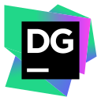
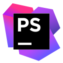
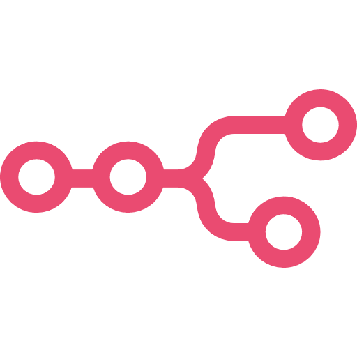

<!-- SOCIALS -->
<div align="center">
    <a href="https://www.linkedin.com/in/renaudj/"></a><a href="https://discordapp.com/users/1391357274357891152"></a>
</div>

<!-- WHOAMI -->
<h2 align="center">🪐About me</h2>

<p align="left">
👋 Hi ! 

🌱 I am a third-year CS student 👀 I am particularly interested in application and web development. What excites me is discovering new technologies and exploring the possibilities in programming tools, whether it's web development, OOP, UI/UX, or databases. I constantly aim to improve and expand my technical and social skills through various educational and personal projects.

⚡**Interests:** CS, space, badminton, volleyball, technological advancements, and the video game industry 💻🪐🌸🏸🏐
</p>

<!-- TECHSTACK -->
<br clear="both">
<h2 align="center">💻 Techstack</h2>

<h4 align="center">Web</h4>
<table align="center">
  <tr>
    <td></td>
    <td></td>
    <td></td>
    <td></td>
  </tr>
  <tr>
    <td></td>
    <td></td>
    <td></td>
    <td></td>
  </tr>
  <tr>
    <td></td>
    <td></td>
    <td></td>
    <td></td>
  </tr>
</table>

<h4 align="center">Database</h4>
<table align="center">
  <tr>
    <td></td>
    <td></td>
    <td></td>
    <td></td>
  </tr>
  <tr>
    <td></td>
    <td></td>
  </tr>
</table>

<h4 align="center">General Development</h4>
<table align="center">
  <tr>
    <td></td>
    <td></td>
    <td></td>
    <td></td>
  </tr>
</table>

<h4 align="center">Engines</h4>
<table align="center">
  <tr>
    <td></td>
  </tr>
</table>

<h4 align="center">Build & Deployment</h4>
<table align="center">
  <tr>
    <td></td>
    <td></td>
    <td></td>
    <td></td>
  </tr>
</table>

<h4 align="center">IDE</h4>
<table align="center">
  <tr>
    <td></td>
    <td></td>
    <td></td>
    <td></td>
  </tr>
  <tr>
    <td></td>
    <td></td>
    <td></td>
  </tr>
</table>

<h4 align="center">Collaboration & Tools</h4>
<table align="center">
  <tr>
    <td></td>
    <td></td>
    <td></td>
    <td></td>
  </tr>
  <tr>
    <td></td>
    <td></td>
    <td></td>
    <td></td>
  </tr>
</table>

<!-- STATS -->
<br clear="both">
<h2 align="center">📊 Stats</h2>

<div align="center">
    
    
</div>
<div align="center">
    
    
</div>
<br clear="both">

> [!NOTE]
> The *WakaTime* stats below have been recorded since 29 December 2025

<!--START_SECTION:waka-->

```yaml
From: 26 April 2025 - To: 26 April 2026

Total Time: 155 hrs 22 mins

JavaScript       65 hrs 33 mins        ▇▇▇▇▇▇▇▇▇▇▅▂▂▂▂▂▂▂▂▂▂▂▂▂▂   42.19 %
PHP              25 hrs 5 mins         ▇▇▇▇▂▂▂▂▂▂▂▂▂▂▂▂▂▂▂▂▂▂▂▂▂   16.15 %
Scala            18 hrs 56 mins        ▇▇▇▂▂▂▂▂▂▂▂▂▂▂▂▂▂▂▂▂▂▂▂▂▂   12.19 %
Java             9 hrs 27 mins         ▇▅▂▂▂▂▂▂▂▂▂▂▂▂▂▂▂▂▂▂▂▂▂▂▂   06.08 %
C#               7 hrs 35 mins         ▇▃▂▂▂▂▂▂▂▂▂▂▂▂▂▂▂▂▂▂▂▂▂▂▂   04.88 %
Markdown         7 hrs 10 mins         ▇▃▂▂▂▂▂▂▂▂▂▂▂▂▂▂▂▂▂▂▂▂▂▂▂   04.61 %
YAML             5 hrs 49 mins         ▇▂▂▂▂▂▂▂▂▂▂▂▂▂▂▂▂▂▂▂▂▂▂▂▂   03.75 %
Twig             4 hrs 19 mins         ▆▂▂▂▂▂▂▂▂▂▂▂▂▂▂▂▂▂▂▂▂▂▂▂▂   02.78 %
```

<!--END_SECTION:waka-->

<div align="center">
    
</div>
